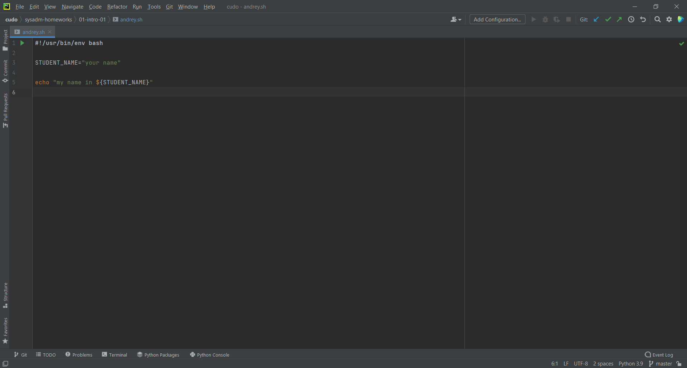

# Домашнее задание к занятию «1.1. Введение в DevOps»

## Задание №1 - Подготовка рабочей среды

1. Подсветка синтаксиса:
    - Terraform: 
    - Bash: 
    - Markdown: 
    - Yaml: 
    - Jsonnet: 
 

## Задание №2 - Описание жизненного цикла задачи (разработки нового функционала)

Сперва разработчики пишут код (продукт). Затем тестировщик прогоняет результат через тестовые стенды, выявляя баги. Если тестирование не пройдено, продукт направляется на доработку разработчику. Если же процесс тестирования завершается успешно, тогда в дело вступает менеджер. Он проверяет продукт и если его все устраивает, он показывает его клиенту, в противном случае продукт отправляется на доработку. После того, как клиента все устраивает, DevOps-инженер автоматизирует сборку и доставку кода от разработчиков в продакшн, а так же автоматизирует процесс мониторинга и отката изменений, если это требуется.
