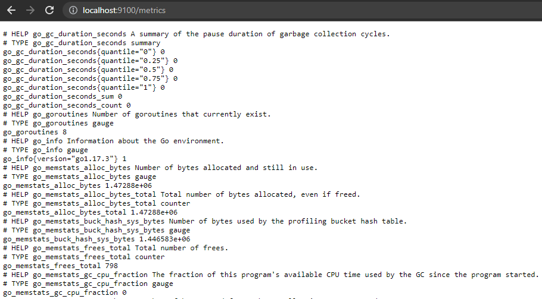
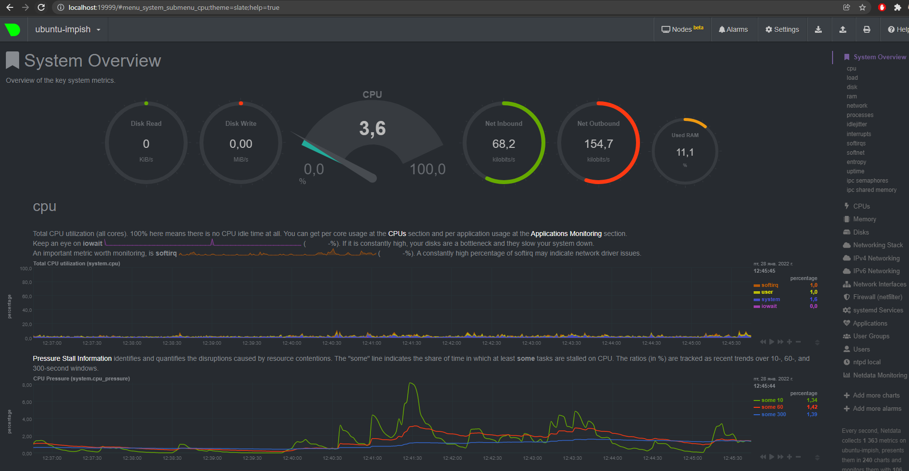

# Домашнее задание к занятию "3.4. Операционные системы, лекция 2"

1. На лекции мы познакомились с [node_exporter](https://github.com/prometheus/node_exporter/releases). В демонстрации его исполняемый файл запускался в background. Этого достаточно для демо, но не для настоящей production-системы, где процессы должны находиться под внешним управлением. Используя знания из лекции по systemd, создайте самостоятельно простой [unit-файл](https://www.freedesktop.org/software/systemd/man/systemd.service.html) для node_exporter:

    * поместите его в автозагрузку,
    * предусмотрите возможность добавления опций к запускаемому процессу через внешний файл (посмотрите, например, на `systemctl cat cron`),
    * удостоверьтесь, что с помощью systemctl процесс корректно стартует, завершается, а после перезагрузки автоматически поднимается.
    
- ```bash
   vagrant@ubuntu-impish:~$ systemctl cat node_exporter.service
   # /etc/systemd/system/node_exporter.service
   [Unit]
   Description=Node Exporter

   [Service]
   ExecStart=/usr/bin/node_exporter
   EnvironmentFile=/etc/node_exporter/env.conf

   [Install]
   WantedBy=default.target   
  ```
  
- ```bash
  vagrant@ubuntu-impish:~$ sudo systemctl enable node_exporter.service
  vagrant@ubuntu-impish:~$ sudo systemctl start node_exporter.service
  vagrant@ubuntu-impish:~$ sudo systemctl status node_exporter.service
  ● node_exporter.service - Node Exporter
     Loaded: loaded (/etc/systemd/system/node_exporter.service; enabled; vendor preset: enabled)
     Active: active (running) since Fri 2022-01-28 12:01:58 MSK; 9min ago
   Main PID: 638 (node_exporter)
      Tasks: 5 (limit: 2338)
     Memory: 14.0M
        CPU: 75ms
     CGroup: /system.slice/node_exporter.service
             └─638 /usr/bin/node_exporter

  Jan 28 12:01:59 ubuntu-impish node_exporter[638]: ts=2022-01-28T09:01:59.398Z caller=node_exporter.go:115 level=info c>
  Jan 28 12:01:59 ubuntu-impish node_exporter[638]: ts=2022-01-28T09:01:59.398Z caller=node_exporter.go:115 level=info c>
  Jan 28 12:01:59 ubuntu-impish node_exporter[638]: ts=2022-01-28T09:01:59.398Z caller=node_exporter.go:115 level=info c>
  Jan 28 12:01:59 ubuntu-impish node_exporter[638]: ts=2022-01-28T09:01:59.398Z caller=node_exporter.go:115 level=info c>
  Jan 28 12:01:59 ubuntu-impish node_exporter[638]: ts=2022-01-28T09:01:59.398Z caller=node_exporter.go:115 level=info c>
  Jan 28 12:01:59 ubuntu-impish node_exporter[638]: ts=2022-01-28T09:01:59.398Z caller=node_exporter.go:115 level=info c>
  Jan 28 12:01:59 ubuntu-impish node_exporter[638]: ts=2022-01-28T09:01:59.398Z caller=node_exporter.go:115 level=info c>
  Jan 28 12:01:59 ubuntu-impish node_exporter[638]: ts=2022-01-28T09:01:59.398Z caller=node_exporter.go:115 level=info c>
  Jan 28 12:01:59 ubuntu-impish node_exporter[638]: ts=2022-01-28T09:01:59.401Z caller=node_exporter.go:199 level=info m>
  Jan 28 12:01:59 ubuntu-impish node_exporter[638]: ts=2022-01-28T09:01:59.402Z caller=tls_config.go:195 level=info msg=>
  
  vagrant@ubuntu-impish:~$ sudo systemctl stop node_exporter.service
  vagrant@ubuntu-impish:~$ sudo systemctl status node_exporter.service
  ○ node_exporter.service - Node Exporter
     Loaded: loaded (/etc/systemd/system/node_exporter.service; enabled; vendor preset: enabled)
     Active: inactive (dead) since Fri 2022-01-28 12:14:54 MSK; 19s ago
    Process: 638 ExecStart=/usr/bin/node_exporter (code=killed, signal=TERM)
   Main PID: 638 (code=killed, signal=TERM)
        CPU: 77ms

  Jan 28 12:01:59 ubuntu-impish node_exporter[638]: ts=2022-01-28T09:01:59.398Z caller=node_exporter.go:115 level=info c>
  Jan 28 12:01:59 ubuntu-impish node_exporter[638]: ts=2022-01-28T09:01:59.398Z caller=node_exporter.go:115 level=info c>
  Jan 28 12:01:59 ubuntu-impish node_exporter[638]: ts=2022-01-28T09:01:59.398Z caller=node_exporter.go:115 level=info c>
  Jan 28 12:01:59 ubuntu-impish node_exporter[638]: ts=2022-01-28T09:01:59.398Z caller=node_exporter.go:115 level=info c>
  Jan 28 12:01:59 ubuntu-impish node_exporter[638]: ts=2022-01-28T09:01:59.398Z caller=node_exporter.go:115 level=info c>
  Jan 28 12:01:59 ubuntu-impish node_exporter[638]: ts=2022-01-28T09:01:59.401Z caller=node_exporter.go:199 level=info m>
  Jan 28 12:01:59 ubuntu-impish node_exporter[638]: ts=2022-01-28T09:01:59.402Z caller=tls_config.go:195 level=info msg=>
  Jan 28 12:14:54 ubuntu-impish systemd[1]: Stopping Node Exporter...
  Jan 28 12:14:54 ubuntu-impish systemd[1]: node_exporter.service: Deactivated successfully.
  Jan 28 12:14:54 ubuntu-impish systemd[1]: Stopped Node Exporter.
  
  vagrant@ubuntu-impish:~$ sudo cat /proc/2259/environ
  LANG=C.UTF-8PATH=/usr/local/sbin:/usr/local/bin:/usr/sbin:/usr/bin:/sbin:/bin:/snap/binINVOCATION_ID=a34e030c6d0143c78  
  bf9284f19f60432JOURNAL_STREAM=8:23167SYSTEMD_EXEC_PID=2259ONE=oneTWO='two two'
  
  vagrant@ubuntu-impish:~$ cat /etc/node_exporter/env.conf
  ONE='one' "TWO='two two' too"
  ```
2. Ознакомьтесь с опциями node_exporter и выводом `/metrics` по-умолчанию. Приведите несколько опций, которые вы бы выбрали для базового мониторинга хоста по CPU, памяти, диску и сети.
   
   

- ````bash
  CPU:  
    node_cpu_seconds_total{cpu="0",mode="idle"} 2238.49  
    node_cpu_seconds_total{cpu="0",mode="system"} 16.72  
    node_cpu_seconds_total{cpu="0",mode="user"} 6.86  
    process_cpu_seconds_total  
    
  Memory:  
    node_memory_MemAvailable_bytes   
    node_memory_MemFree_bytes  
    
  Disk:  
    node_disk_io_time_seconds_total{device="sda"}   
    node_disk_read_bytes_total{device="sda"}   
    node_disk_read_time_seconds_total{device="sda"}   
    node_disk_write_time_seconds_total{device="sda"}  
    
  Network:  
    node_network_receive_errs_total{device="eth0"}   
    node_network_receive_bytes_total{device="eth0"}   
    node_network_transmit_bytes_total{device="eth0"}  
    node_network_transmit_errs_total{device="eth0"}  
  ````


3. Установите в свою виртуальную машину [Netdata](https://github.com/netdata/netdata). Воспользуйтесь [готовыми пакетами](https://packagecloud.io/netdata/netdata/install) для установки (`sudo apt install -y netdata`). После успешной установки:
    * в конфигурационном файле `/etc/netdata/netdata.conf` в секции [web] замените значение с localhost на `bind to = 0.0.0.0`,
    * добавьте в Vagrantfile проброс порта Netdata на свой локальный компьютер и сделайте `vagrant reload`:

    ```bash
    config.vm.network "forwarded_port", guest: 19999, host: 19999
    ```

    После успешной перезагрузки в браузере *на своем ПК* (не в виртуальной машине) вы должны суметь зайти на `localhost:19999`. Ознакомьтесь с метриками, которые по умолчанию собираются Netdata и с комментариями, которые даны к этим метрикам.




4. Можно ли по выводу `dmesg` понять, осознает ли ОС, что загружена не на настоящем оборудовании, а на системе виртуализации?

- ````bash
  vagrant@ubuntu-impish:~$ sudo dmesg | grep virtual
  [    0.003199] CPU MTRRs all blank - virtualized system.
  [    0.027073] Booting paravirtualized kernel on KVM
  [    7.323247] systemd[1]: Detected virtualization oracle.
  
5. Как настроен sysctl `fs.nr_open` на системе по-умолчанию? Узнайте, что означает этот параметр. Какой другой существующий лимит не позволит достичь такого числа (`ulimit --help`)?

- ````bash
  vagrant@ubuntu-impish:~$ sysctl fs.nr_open
  fs.nr_open = 1048576
- Это максимальное количество файловых дескрипторов, поддерживаемых ядром, то есть максимальное количество файловых дескрипторов, используемых процессом. Чтобы просмотреть максимальное количество открытых символов описания файла процесса, поддерживаемых аппаратным обеспечением системы, можно использовать `ulimit -Hn`. `ulimit -Sn` - установит мягкое ограничение максимального числа дескрипторов открытых файлов. Мягкое ограничение не может превышать жесткое ограничение.

6. Запустите любой долгоживущий процесс (не `ls`, который отработает мгновенно, а, например, `sleep 1h`) в отдельном неймспейсе процессов; покажите, что ваш процесс работает под PID 1 через `nsenter`. Для простоты работайте в данном задании под root (`sudo -i`). Под обычным пользователем требуются дополнительные опции (`--map-root-user`) и т.д.

- ````bash
  root@ubuntu-impish:~# unshare -f --pid --mount-proc sleep 1h
  root@ubuntu-impish:~# ps aux | grep sleep
  root        7887  0.0  0.0   7636   996 pts/0    S+   14:09   0:00 unshare -f --pid --mount-proc sleep 1h
  root        7888  0.0  0.0   7644   972 pts/0    S+   14:09   0:00 sleep 1h
  root@ubuntu-impish:~# nsenter --target 7888 --pid --mount
  root@ubuntu-impish:~# ps aux
  USER         PID %CPU %MEM    VSZ   RSS TTY      STAT START   TIME COMMAND
  root           1  0.0  0.0   7644   972 pts/0    S+   14:09   0:00 sleep 1h
  root           2  0.8  0.2  10584  5408 pts/1    S    14:13   0:00 -bash
  root          13  0.0  0.1  11780  3532 pts/1    R+   14:13   0:00 ps aux

7. Найдите информацию о том, что такое `:(){ :|:& };:`. Запустите эту команду в своей виртуальной машине Vagrant с Ubuntu 20.04 (**это важно, поведение в других ОС не проверялось**). Некоторое время все будет "плохо", после чего (минуты) – ОС должна стабилизироваться. Вызов `dmesg` расскажет, какой механизм помог автоматической стабилизации. Как настроен этот механизм по-умолчанию, и как изменить число процессов, которое можно создать в сессии?

 
 - `:(){ :|:& };:` называется форк-бомбой. Это функция Bash, которая параллельно пускает два своих экземпляра. Каждый пускает ещё по два и т.д. 
При отсутствии лимита на число процессов машина быстро исчерпывает физическую память.  
`ulimit -u 30` - ограничит число процессов до 30 для пользователя.
