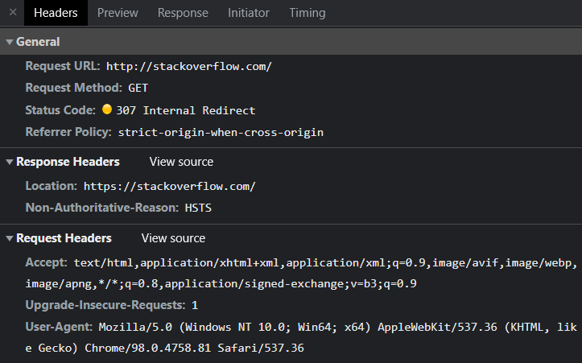
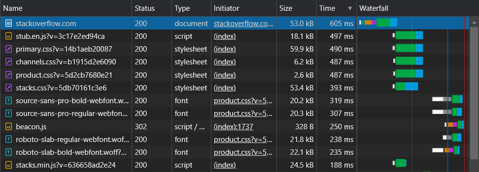

# Домашнее задание к занятию "3.6. Компьютерные сети, лекция 1"

1. Работа c HTTP через телнет.
- Подключитесь утилитой телнет к сайту stackoverflow.com
`telnet stackoverflow.com 80`
- отправьте HTTP запрос
```bash
GET /questions HTTP/1.0
HOST: stackoverflow.com
[press enter]
[press enter]
```
- В ответе укажите полученный HTTP код, что он означает?

* ```bash
    vagrant@ubuntu-impish:~$ telnet stackoverflow.com 80
    Trying 151.101.129.69...
    Connected to stackoverflow.com.
    Escape character is '^]'.
    GET /questions HTTP/1.0
    HOST: stackoverflow.com

    HTTP/1.1 301 Moved Permanently
    cache-control: no-cache, no-store, must-revalidate
    location: https://stackoverflow.com/questions
    x-request-guid: 9a457be9-4fbe-4521-8157-76ffe5891207
    feature-policy: microphone 'none'; speaker 'none'
    content-security-policy: upgrade-insecure-requests; frame-ancestors 'self' https://stackexchange.com
    Accept-Ranges: bytes
    Date: Tue, 08 Feb 2022 18:23:01 GMT
    Via: 1.1 varnish
    Connection: close
    X-Served-By: cache-fra19141-FRA
    X-Cache: MISS
    X-Cache-Hits: 0
    X-Timer: S1644344581.243249,VS0,VE86
    Vary: Fastly-SSL
    X-DNS-Prefetch-Control: off
    Set-Cookie: prov=27760b6f-ad16-82cd-257f-596cadbc3cb5; domain=.stackoverflow.com; expires=Fri, 01-Jan-2055 00:00:00 GMT; path=/; HttpOnly

    Connection closed by foreign host.
  ```

* Код ответа `301 Moved Permanently` "Перемещён на постоянной основе". Этот код ответа значит, что URL запрашиваемого ресурса был изменён. В ответе предоставлен новый URL `https://stackoverflow.com`

2. Повторите задание 1 в браузере, используя консоль разработчика F12.
- откройте вкладку `Network`
- отправьте запрос http://stackoverflow.com
- найдите первый ответ HTTP сервера, откройте вкладку `Headers`
- укажите в ответе полученный HTTP код.
- проверьте время загрузки страницы, какой запрос обрабатывался дольше всего?
- приложите скриншот консоли браузера в ответ.

*  
*  


3. Какой IP адрес у вас в интернете?

*  ```bash
    vagrant@ubuntu-impish:~$ curl ifconfig.me/ip
    109.165.22.92
   ```

4. Какому провайдеру принадлежит ваш IP адрес? Какой автономной системе AS? Воспользуйтесь утилитой `whois`

*  ```bash
    vagrant@ubuntu-impish:~$ whois -h whois.ripe.net 109.165.22.92

    inetnum:        109.165.0.0 - 109.165.63.255
    netname:        Macroregional_South
    descr:          OJSC Rostelecom Macroregional Branch South
    descr:          Rostov, Russia
    country:        RU
    admin-c:        VAS102-RIPE
    tech-c:         VAS102-RIPE
    status:         ASSIGNED PA
    remarks:        INFRA-AW
    mnt-by:         STC-MNT
    created:        2012-05-25T10:26:33Z
    last-modified:  2012-06-21T11:52:55Z
    source:         RIPE

    person:         Vladimir A. Sherstnev
    address:        wert@donpac.ru
    phone:          +7 863 2619163
    mnt-by:         ROSTOV-TELEGRAF-MNT
    nic-hdl:        VAS102-RIPE
    created:        2005-05-25T05:31:56Z
    last-modified:  2016-01-13T06:40:41Z
    source:         RIPE

    % Information related to '109.165.0.0/18AS12389'

    route:          109.165.0.0/18
    origin:         AS12389
    descr:          BRAS Huawei ME60 (128kusers)
    mnt-by:         ROSTELECOM-MNT
    mnt-by:         ROSTOV-TELEGRAF-MNT
    created:        2018-01-15T08:53:38Z
    last-modified:  2018-01-15T08:53:38Z
    source:         RIPE

    % Information related to '109.165.0.0/18AS21479'

    route:          109.165.0.0/18
    descr:          Routing object of
    descr:          Division of JSC "UTK" "Rostovelectrosviaz" and its deport
    origin:         AS21479
    mnt-routes:     ROSTOV-TELEGRAF-MNT
    mnt-by:         ROSTOV-TELEGRAF-MNT
    created:        2009-10-30T06:20:27Z
    last-modified:  2009-10-30T06:20:27Z
    source:         RIPE
   ```

5. Через какие сети проходит пакет, отправленный с вашего компьютера на адрес 8.8.8.8? Через какие AS? Воспользуйтесь утилитой `traceroute`

* ```bash
    vagrant@ubuntu-impish:~$ traceroute -IAn 8.8.8.8
    traceroute to 8.8.8.8 (8.8.8.8), 30 hops max, 60 byte packets
    1  10.0.2.2 [*]  0.894 ms  0.440 ms  0.372 ms
    2  192.168.0.1 [*]  5.119 ms  4.904 ms  4.837 ms
    3  178.34.128.50 [AS12389]  4.772 ms  4.650 ms 178.34.129.237 [AS12389]  4.422 ms
    4  87.226.183.89 [AS12389]  244.573 ms  244.512 ms  244.448 ms
    5  5.143.253.105 [AS12389]  244.814 ms  244.738 ms  244.673 ms
    6  108.170.250.113 [AS15169]  244.158 ms  101.208 ms  101.111 ms
    7  216.239.51.32 [AS15169]  101.020 ms * *
    8  172.253.66.110 [AS15169]  100.542 ms  100.414 ms  100.284 ms
    9  216.239.46.243 [AS15169]  100.129 ms  98.789 ms  99.093 ms
    10  * * *
    11  * * *
    12  * * *
    13  * * *
    14  * * *
    15  * * *
    16  * * *
    17  * * *
    18  * * *
    19  8.8.8.8 [AS15169]  127.356 ms * *
  ```

6. Повторите задание 5 в утилите `mtr`. На каком участке наибольшая задержка - delay?

*  ```bash
    vagrant@ubuntu-impish:~$ mtr -zn 8.8.8.8

                                    My traceroute  [v0.94]
    ubuntu-impish (10.0.2.15) -> 8.8.8.8                              2022-02-08T19:11:09+0000
    Keys:  Help   Display mode   Restart statistics   Order of fields   quit
                                                    Packets               Pings
    Host                                           Loss%   Snt   Last   Avg  Best  Wrst StDev
    1. AS???    10.0.2.2                            0.0%    66    0.7   1.0   0.5   2.2   0.3
    2. AS???    192.168.0.1                         0.0%    65    3.4   5.6   3.0 109.7  13.1
    3. AS12389  178.34.129.237                      0.0%    65    4.5   9.8   3.3 307.6  37.6
       AS12389  178.34.128.50
    4. AS12389  87.226.183.89                       0.0%    65   40.1  30.9  28.1  62.6   4.9
    5. AS12389  5.143.253.105                       0.0%    65   28.9  34.7  28.4 263.8  30.0
    6. AS15169  108.170.250.113                     4.6%    65   20.5  26.5  20.3 223.9  26.6
    7. AS15169  216.239.51.32                      61.5%    65   34.9  36.9  34.9  48.3   2.6
    8. AS15169  172.253.66.110                      0.0%    65   41.9  38.7  36.3 102.5   8.3
    9. AS15169  216.239.46.243                      0.0%    65   38.5  39.8  37.6 102.2   7.9
    10. (waiting for reply)
    11. (waiting for reply)
    12. (waiting for reply)
    13. (waiting for reply)
    14. (waiting for reply)
    15. (waiting for reply)
    16. (waiting for reply)
    17. (waiting for reply)
    18. (waiting for reply)
    19. AS15169  8.8.8.8                            38.5%    65   37.8  38.6  34.5 106.0  11.0
   ```
  * Самая большая задержка `Wrst` на 3 участке, а по среднему показателю `Avg` на 9 участке.

7. Какие DNS сервера отвечают за доменное имя dns.google? Какие A записи? воспользуйтесь утилитой `dig`

* ```bash
    vagrant@ubuntu-impish:~$ dig dns.google

    ; <<>> DiG 9.16.15-Ubuntu <<>> dns.google
    ;; global options: +cmd
    ;; Got answer:
    ;; ->>HEADER<<- opcode: QUERY, status: NOERROR, id: 29136
    ;; flags: qr rd ra; QUERY: 1, ANSWER: 2, AUTHORITY: 0, ADDITIONAL: 1

    ;; OPT PSEUDOSECTION:
    ; EDNS: version: 0, flags:; udp: 65494
    ;; QUESTION SECTION:
    ;dns.google.                    IN      A

    ;; ANSWER SECTION:
    dns.google.             862     IN      A       8.8.4.4
    dns.google.             862     IN      A       8.8.8.8

    ;; Query time: 7 msec
    ;; SERVER: 127.0.0.53#53(127.0.0.53)
    ;; WHEN: Tue Feb 08 19:20:02 UTC 2022
    ;; MSG SIZE  rcvd: 71
  ```

8. Проверьте PTR записи для IP адресов из задания 7. Какое доменное имя привязано к IP? воспользуйтесь утилитой `dig`

* ```bash
    vagrant@ubuntu-impish:~$ dig -x 8.8.4.4

    ; <<>> DiG 9.16.15-Ubuntu <<>> -x 8.8.4.4
    ;; global options: +cmd
    ;; Got answer:
    ;; ->>HEADER<<- opcode: QUERY, status: NOERROR, id: 19920
    ;; flags: qr rd ra; QUERY: 1, ANSWER: 1, AUTHORITY: 0, ADDITIONAL: 1

    ;; OPT PSEUDOSECTION:
    ; EDNS: version: 0, flags:; udp: 65494
    ;; QUESTION SECTION:
    ;4.4.8.8.in-addr.arpa.          IN      PTR

    ;; ANSWER SECTION:
    4.4.8.8.in-addr.arpa.   24676   IN      PTR     dns.google.

    ;; Query time: 596 msec
    ;; SERVER: 127.0.0.53#53(127.0.0.53)
    ;; WHEN: Tue Feb 08 19:21:15 UTC 2022
    ;; MSG SIZE  rcvd: 73
   ```

 * ```bash
    vagrant@ubuntu-impish:~$ dig -x 8.8.8.8

    ; <<>> DiG 9.16.15-Ubuntu <<>> -x 8.8.8.8
    ;; global options: +cmd
    ;; Got answer:
    ;; ->>HEADER<<- opcode: QUERY, status: NOERROR, id: 10534
    ;; flags: qr rd ra; QUERY: 1, ANSWER: 1, AUTHORITY: 0, ADDITIONAL: 1

    ;; OPT PSEUDOSECTION:
    ; EDNS: version: 0, flags:; udp: 65494
    ;; QUESTION SECTION:
    ;8.8.8.8.in-addr.arpa.          IN      PTR

    ;; ANSWER SECTION:
    8.8.8.8.in-addr.arpa.   82627   IN      PTR     dns.google.

    ;; Query time: 3 msec
    ;; SERVER: 127.0.0.53#53(127.0.0.53)
    ;; WHEN: Tue Feb 08 19:21:28 UTC 2022
    ;; MSG SIZE  rcvd: 73
   ```
