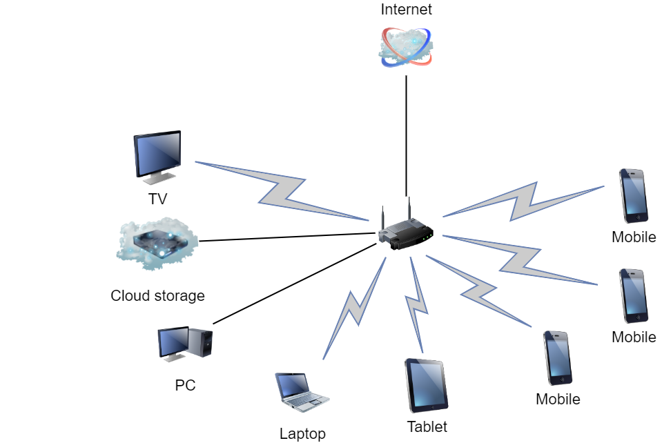

# Домашнее задание к занятию "3.8. Компьютерные сети, лекция 3"

1. Подключитесь к публичному маршрутизатору в интернет. Найдите маршрут к вашему публичному IP
```
telnet route-views.routeviews.org
Username: rviews
show ip route x.x.x.x/32
show bgp x.x.x.x/32
```


* ```bash
  route-views>show ip route 80.80.104.101
  Routing entry for 80.80.104.0/22
  Known via "bgp 6447", distance 20, metric 0
  Tag 2497, type external
  Last update from 202.232.0.2 3w4d ago
  Routing Descriptor Blocks:
  * 202.232.0.2, from 202.232.0.2, 3w4d ago
      Route metric is 0, traffic share count is 1
      AS Hops 3
      Route tag 2497
      MPLS label: none
  ```

* ```bash
   route-views>show bgp 80.80.104.101
   BGP routing table entry for 80.80.104.0/22, version 224070
   Paths: (23 available, best #19, table default)
   Not advertised to any peer
   Refresh Epoch 2
  ...
  2497 8359 60496
    202.232.0.2 from 202.232.0.2 (58.138.96.254)
      Origin IGP, localpref 100, valid, external, best
      path 7FE14350A158 RPKI State not found
      rx pathid: 0, tx pathid: 0x0
  ...
  ```
2. Создайте dummy0 интерфейс в Ubuntu. Добавьте несколько статических маршрутов. Проверьте таблицу маршрутизации.

* ```bash
  vagrant@ubuntu-impish:~$ sudo modprobe -v dummy numdummies=1
  vagrant@ubuntu-impish:~$ sudo ip addr add 10.10.10.1/24 dev dummy0
  vagrant@ubuntu-impish:~$ sudo ip link set up dummy0
  
  vagrant@ubuntu-impish:~$ ip a
    1: lo: <LOOPBACK,UP,LOWER_UP> mtu 65536 qdisc noqueue state UNKNOWN group default qlen 1000
        link/loopback 00:00:00:00:00:00 brd 00:00:00:00:00:00
        inet 127.0.0.1/8 scope host lo
           valid_lft forever preferred_lft forever
        inet6 ::1/128 scope host
           valid_lft forever preferred_lft forever
    2: enp0s3: <BROADCAST,MULTICAST,UP,LOWER_UP> mtu 1500 qdisc fq_codel state UP group default qlen 1000
        link/ether 02:27:86:57:bb:2a brd ff:ff:ff:ff:ff:ff
        inet 10.0.2.15/24 brd 10.0.2.255 scope global dynamic enp0s3
           valid_lft 86116sec preferred_lft 86116sec
        inet6 fe80::27:86ff:fe57:bb2a/64 scope link
           valid_lft forever preferred_lft forever
    3: enp0s8: <BROADCAST,MULTICAST,UP,LOWER_UP> mtu 1500 qdisc fq_codel state UP group default qlen 1000
        link/ether 08:00:27:25:7e:3a brd ff:ff:ff:ff:ff:ff
        inet 192.168.33.10/24 brd 192.168.33.255 scope global enp0s8
           valid_lft forever preferred_lft forever
        inet6 fe80::a00:27ff:fe25:7e3a/64 scope link
           valid_lft forever preferred_lft forever
    4: enp0s9: <BROADCAST,MULTICAST,UP,LOWER_UP> mtu 1500 qdisc fq_codel state UP group default qlen 1000
        link/ether 08:00:27:b8:90:27 brd ff:ff:ff:ff:ff:ff
        inet 172.20.20.10/24 brd 172.20.20.255 scope global enp0s9
           valid_lft forever preferred_lft forever
        inet6 fe80::a00:27ff:feb8:9027/64 scope link
           valid_lft forever preferred_lft forever
    5: dummy0: <BROADCAST,NOARP,UP,LOWER_UP> mtu 1500 qdisc noqueue state UNKNOWN group default qlen 1000
        link/ether 7a:f6:2b:91:2e:89 brd ff:ff:ff:ff:ff:ff
        inet 10.10.10.1/24 scope global dummy0
           valid_lft forever preferred_lft forever
        inet6 fe80::78f6:2bff:fe91:2e89/64 scope link
           valid_lft forever preferred_lft forever
  ```
* ```bash
  vagrant@ubuntu-impish:~$ sudo ip route add 172.6.66.0/24 via 172.20.20.10
  vagrant@ubuntu-impish:~$ sudo ip route add 10.100.100.0/24 via 192.168.33.10
  
  vagrant@ubuntu-impish:~$ ip r
    default via 10.0.2.2 dev enp0s3 proto dhcp src 10.0.2.15 metric 100
    10.0.2.0/24 dev enp0s3 proto kernel scope link src 10.0.2.15
    10.0.2.2 dev enp0s3 proto dhcp scope link src 10.0.2.15 metric 100
    10.10.10.0/24 dev dummy0 proto kernel scope link src 10.10.10.1
    10.100.100.0/24 via 192.168.33.10 dev enp0s8
    172.6.66.0/24 via 172.20.20.10 dev enp0s9
    172.20.20.0/24 dev enp0s9 proto kernel scope link src 172.20.20.10
    192.168.33.0/24 dev enp0s8 proto kernel scope link src 192.168.33.10
  ```  
  На VM стоит Ubuntu 21.10 в ней сеть настраивается через netplan. dummy0 интерфейс он не понимает, а при добавлении маршрутов конфигурация применяется, но в таблицу маршрутизации они почему-то не попадают...
3. Проверьте открытые TCP порты в Ubuntu, какие протоколы и приложения используют эти порты? Приведите несколько примеров.

* ```bash
  vagrant@ubuntu-impish:~$ sudo ss -ltnp
  State       Recv-Q      Send-Q           Local Address:Port           Peer Address:Port      Process
  LISTEN      0           4096             127.0.0.53%lo:53                  0.0.0.0:*          users:(("systemd-resolve",pid=595,fd=14))
  LISTEN      0           128                    0.0.0.0:22                  0.0.0.0:*          users:(("sshd",pid=686,fd=3))
  LISTEN      0           128                       [::]:22                     [::]:*          users:(("sshd",pid=686,fd=4))
  
  vagrant@ubuntu-impish:~$ sudo netstat -tlpn
  Active Internet connections (only servers)
  Proto Recv-Q Send-Q Local Address           Foreign Address         State       PID/Program name
  tcp        0      0 127.0.0.53:53           0.0.0.0:*               LISTEN      595/systemd-resolve
  tcp        0      0 0.0.0.0:22              0.0.0.0:*               LISTEN      686/sshd: /usr/sbin
  tcp6       0      0 :::22                   :::*                    LISTEN      686/sshd: /usr/sbin
  
  vagrant@ubuntu-impish:~$  nmap localhost
  Starting Nmap 7.80 ( https://nmap.org ) at 2022-02-15 09:38 UTC
  Nmap scan report for localhost (127.0.0.1)
  Host is up (0.00023s latency).
  Not shown: 999 closed ports
  PORT   STATE SERVICE
  22/tcp open  ssh
  
  Nmap done: 1 IP address (1 host up) scanned in 0.17 seconds
  ```

4. Проверьте используемые UDP сокеты в Ubuntu, какие протоколы и приложения используют эти порты?

* ```bash
  vagrant@ubuntu-impish:~$ sudo ss -uanp
  State      Recv-Q     Send-Q              Local Address:Port           Peer Address:Port     Process
  UNCONN     0          0                   127.0.0.53%lo:53                  0.0.0.0:*         users:(("systemd-resolve",pid=595,fd=13))
  UNCONN     0          0                10.0.2.15%enp0s3:68                  0.0.0.0:*         users:(("systemd-network",pid=1695,fd=17))
  UNCONN     0          0                       127.0.0.1:161                 0.0.0.0:*         users:(("snmpd",pid=654,fd=6))
  UNCONN     0          0                           [::1]:161                    [::]:*         users:(("snmpd",pid=654,fd=7))
  ```

5. Используя diagrams.net, создайте L3 диаграмму вашей домашней сети или любой другой сети, с которой вы работали. 

* 
