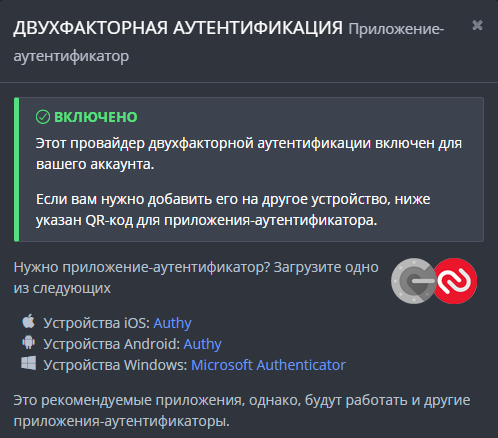

# Домашнее задание к занятию "3.9. Элементы безопасности информационных систем"

1. Установите Bitwarden плагин для браузера. Зарегестрируйтесь и сохраните несколько паролей.

   

2. Установите Google authenticator на мобильный телефон. Настройте вход в Bitwarden акаунт через Google authenticator OTP.

* Так как на смартфоне невозможно сделать screenshot Google Authenticator, прилагаю скрин из настроек профиля:
   
  

3. Установите apache2, сгенерируйте самоподписанный сертификат, настройте тестовый сайт для работы по HTTPS.

   
   

1. Проверьте на TLS уязвимости произвольный сайт в интернете (кроме сайтов МВД, ФСБ, МинОбр, НацБанк, РосКосмос, РосАтом, РосНАНО и любых госкомпаний, объектов КИИ, ВПК ... и тому подобное).

* ```bash
  vagrant@ubuntu-impish:~/testssl/testssl.sh$ ./testssl.sh -U --sneaky https://www.overclockers.ru
   
   Testing vulnerabilities

  Heartbleed (CVE-2014-0160)                not vulnerable (OK), no heartbeat extension
  CCS (CVE-2014-0224)                       not vulnerable (OK)
  Ticketbleed (CVE-2016-9244), experiment.  not vulnerable (OK)
  ROBOT                                     not vulnerable (OK)
  Secure Renegotiation (RFC 5746)           supported (OK)
  Secure Client-Initiated Renegotiation     not vulnerable (OK)
  CRIME, TLS (CVE-2012-4929)                not vulnerable (OK)
  BREACH (CVE-2013-3587)                    no gzip/deflate/compress/br HTTP compression (OK)  - only supplied "/" tested
  POODLE, SSL (CVE-2014-3566)               not vulnerable (OK)
  TLS_FALLBACK_SCSV (RFC 7507)              Downgrade attack prevention supported (OK)
  SWEET32 (CVE-2016-2183, CVE-2016-6329)    not vulnerable (OK)
  FREAK (CVE-2015-0204)                     not vulnerable (OK)
  DROWN (CVE-2016-0800, CVE-2016-0703)      not vulnerable on this host and port (OK)
                                            make sure you don't use this certificate elsewhere with SSLv2 enabled services
                                            https://censys.io/ipv4?q=ADC0090A5F12F4C1CA218D08C9DFD8CA3A633EC070C12458B30D294FB6EC616A could help you to find out
  LOGJAM (CVE-2015-4000), experimental      not vulnerable (OK): no DH EXPORT ciphers, no DH key detected with <= TLS 1.2
  BEAST (CVE-2011-3389)                     TLS1: ECDHE-RSA-AES128-SHA AES128-SHA ECDHE-RSA-AES256-SHA
                                                  AES256-SHA
                                            VULNERABLE -- but also supports higher protocols  TLSv1.1 TLSv1.2 (likely mitigated)
  LUCKY13 (CVE-2013-0169), experimental     potentially VULNERABLE, uses cipher block chaining (CBC) ciphers with TLS. Check patches
  Winshock (CVE-2014-6321), experimental    not vulnerable (OK)
  RC4 (CVE-2013-2566, CVE-2015-2808)        no RC4 ciphers detected (OK)
  ```

5. Установите на Ubuntu ssh сервер, сгенерируйте новый приватный ключ. Скопируйте свой публичный ключ на другой сервер. Подключитесь к серверу по SSH-ключу.
 
* ```bash
  vagrant@ubuntu-impish:~$ ssh-keygen -t rsa
  Generating public/private rsa key pair.
  Enter file in which to save the key (/home/vagrant/.ssh/id_rsa):
  Enter passphrase (empty for no passphrase):
  Enter same passphrase again:
  Your identification has been saved in /home/vagrant/.ssh/id_rsa
  Your public key has been saved in /home/vagrant/.ssh/id_rsa.pub
  The key fingerprint is:
  SHA256:1tha5MkuDSHzq/YK+wXO0OqK4dVMnc+zjCOPBAxfBrw vagrant@ubuntu-impish
  The key's randomart image is:
  +---[RSA 3072]----+
  |  ..             |
  |   ..            |
  | .  .oo . .      |
  |  +Eo..+.O .     |
  |   +..ooS B      |
  |    == ooB       |
  |.  .o+o =+o      |
  |.o...+o+o.o      |
  |....o+*=oo       |
  +----[SHA256]-----+
  ```
* ```bash
  vagrant@ubuntu-impish:~$ ssh-copy-id vagrant@192.168.33.20
  /usr/bin/ssh-copy-id: INFO: Source of key(s) to be installed: "/home/vagrant/.ssh/id_rsa.pub"
  The authenticity of host '192.168.33.20 (192.168.33.20)' can't be established.
  ECDSA key fingerprint is SHA256:FCOCnx5mmDN13ZE/a0ZyJcMvgKqfqJ/xlenr/GXlUts.
  Are you sure you want to continue connecting (yes/no/[fingerprint])? yes
  /usr/bin/ssh-copy-id: INFO: attempting to log in with the new key(s), to filter out any that are already installed
  /usr/bin/ssh-copy-id: INFO: 1 key(s) remain to be installed -- if you are prompted now it is to install the new keys
  vagrant@192.168.33.20's password:

  Number of key(s) added: 1

  Now try logging into the machine, with:   "ssh 'vagrant@192.168.33.20'"
  and check to make sure that only the key(s) you wanted were added.
  ```
* ```bash
  vagrant@ubuntu-impish:~$ ssh vagrant@192.168.33.20
  Last login: Fri Feb 18 08:50:31 2022 from 10.0.2.2
  [vagrant@archlinux ~]$ uname -a
  Linux archlinux 5.16.2-arch1-1 #1 SMP PREEMPT Thu, 20 Jan 2022 16:18:29 +0000 x86_64 GNU/Linux
  ```

6. Переименуйте файлы ключей из задания 5. Настройте файл конфигурации SSH клиента, так чтобы вход на удаленный сервер осуществлялся по имени сервера.

* ```bash
  vagrant@ubuntu-impish:~/.ssh$ ll
  total 24
  drwx------ 2 vagrant vagrant 4096 Feb 18 09:11 ./
  drwxr-x--- 6 vagrant vagrant 4096 Feb 18 08:52 ../
  -rw------- 1 vagrant vagrant  389 Feb 10 09:01 authorized_keys
  -rw------- 1 vagrant vagrant 2610 Feb 18 09:04 id_rsa
  -rw-r--r-- 1 vagrant vagrant  575 Feb 18 09:04 id_rsa.pub
  -rw-r--r-- 1 vagrant vagrant  222 Feb 18 09:11 known_hosts  

  vagrant@ubuntu-impish:~/.ssh$ mv id_rsa arch
  vagrant@ubuntu-impish:~/.ssh$ mv id_rsa.pub arch.pub
  vagrant@ubuntu-impish:~/.ssh$ ll
  total 24
  drwx------ 2 vagrant vagrant 4096 Feb 18 09:21 ./
  drwxr-x--- 6 vagrant vagrant 4096 Feb 18 08:52 ../
  -rw------- 1 vagrant vagrant 2610 Feb 18 09:04 arch
  -rw-r--r-- 1 vagrant vagrant  575 Feb 18 09:04 arch.pub
  -rw------- 1 vagrant vagrant  389 Feb 10 09:01 authorized_keys
  -rw-r--r-- 1 vagrant vagrant  222 Feb 18 09:11 known_hosts

  ```
* ```bash
  vagrant@ubuntu-impish:~$ cat .ssh/config
  Host arch
    HostName 192.168.33.20
    Port 22
    IdentityFile /home/vagrant/.ssh/arch

  vagrant@ubuntu-impish:~$ ssh arch
  Last login: Fri Feb 18 09:30:10 2022 from 192.168.33.10
  [vagrant@archlinux ~]$
  ```

7. Соберите дамп трафика утилитой tcpdump в формате pcap, 100 пакетов. Откройте файл pcap в Wireshark.

* ```bash
  vagrant@ubuntu-impish:~$ sudo tcpdump -i enp0s8 -c 100 -w test.pcap -n
  tcpdump: listening on enp0s8, link-type EN10MB (Ethernet), snapshot length 262144 bytes
  100 packets captured
  100 packets received by filter
  0 packets dropped by kernel
  ```
  
## Задание для самостоятельной отработки (необязательно к выполнению)

8*. Просканируйте хост scanme.nmap.org. Какие сервисы запущены?

* ```bash
  vagrant@ubuntu-impish:~$ sudo nmap -sV scanme.nmap.org
  Starting Nmap 7.80 ( https://nmap.org ) at 2022-02-18 19:15 MSK
  Nmap scan report for scanme.nmap.org (45.33.32.156)
  Host is up (0.34s latency).
  Other addresses for scanme.nmap.org (not scanned): 2600:3c01::f03c:91ff:fe18:bb2f
  Not shown: 996 closed ports
  PORT      STATE SERVICE    VERSION
  22/tcp    open  ssh        OpenSSH 6.6.1p1 Ubuntu 2ubuntu2.13 (Ubuntu Linux; protocol 2.0)
  80/tcp    open  http       Apache httpd 2.4.7 ((Ubuntu))
  9929/tcp  open  nping-echo Nping echo
  31337/tcp open  tcpwrapped
  Service Info: OS: Linux; CPE: cpe:/o:linux:linux_kernel

  Service detection performed. Please report any incorrect results at https://nmap.org/submit/ .
  Nmap done: 1 IP address (1 host up) scanned in 405.94 seconds
  ```

9*. Установите и настройте фаервол ufw на web-сервер из задания 3. Откройте доступ снаружи только к портам 22,80,443

* ```bash
  vagrant@ubuntu-impish:~$ sudo ufw status verbose
  Status: active
  Logging: on (low)
  Default: deny (incoming), allow (outgoing), disabled (routed)
  New profiles: skip

  To                         Action      From
  --                         ------      ----
  80/tcp (Apache)            ALLOW IN    Anywhere
  22                         ALLOW IN    Anywhere
  443                        ALLOW IN    Anywhere
  80/tcp (Apache (v6))       ALLOW IN    Anywhere (v6)
  22 (v6)                    ALLOW IN    Anywhere (v6)
  443 (v6)                   ALLOW IN    Anywhere (v6)
  ```
  ```bash
  [vagrant@archlinux ~]$ sudo nmap 192.168.33.10
  Starting Nmap 7.92 ( https://nmap.org ) at 2022-02-18 14:37 UTC
  Nmap scan report for 192.168.33.10
  Host is up (0.00041s latency).
  Not shown: 997 filtered tcp ports (no-response)
  PORT    STATE SERVICE
  22/tcp  open  ssh
  80/tcp  open  http
  443/tcp open  https
  MAC Address: 08:00:27:25:7E:3A (Oracle VirtualBox virtual NIC)

  Nmap done: 1 IP address (1 host up) scanned in 18.86 seconds
    ```