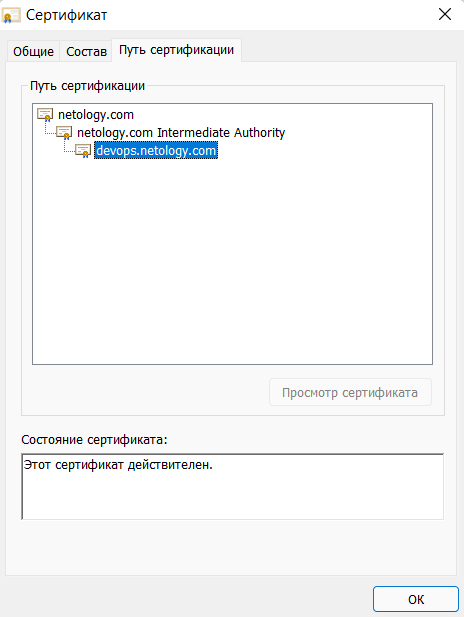
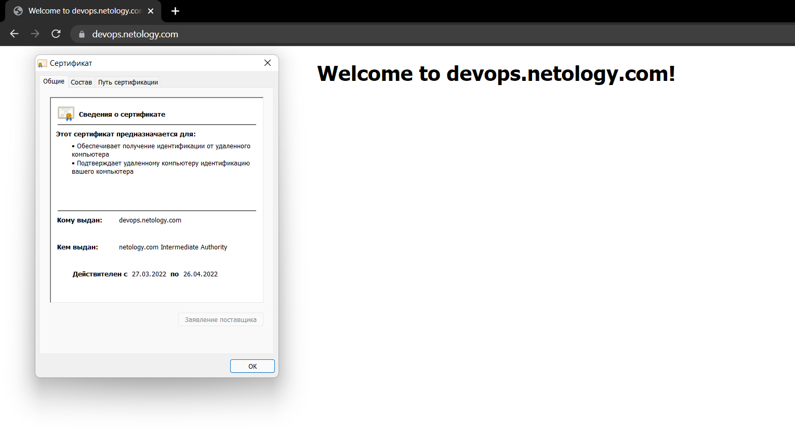

# Курсовая работа по итогам модуля "DevOps и системное администрирование"

## Задание

1. Создайте виртуальную машину Linux.
- создана
2. Установите ufw и разрешите к этой машине сессии на порты 22 и 443, при этом трафик на интерфейсе localhost (lo) должен ходить свободно на все порты.
-	```bash
	vagrant@ubuntu-impish:~$ sudo ufw status verbose
	Status: active
	Logging: on (low)
	Default: deny (incoming), allow (outgoing), disabled (routed)
	New profiles: skip

	To                         Action      From
	--                         ------      ----
	443                        ALLOW IN    Anywhere                  
	22                         ALLOW IN    Anywhere                  
	Anywhere                   ALLOW IN    127.0.0.1                 
	443 (v6)                   ALLOW IN    Anywhere (v6)             
	22 (v6)                    ALLOW IN    Anywhere (v6) 
	```
3. Установите hashicorp vault ([инструкция по ссылке](https://learn.hashicorp.com/tutorials/vault/getting-started-install?in=vault/getting-started#install-vault)).
-	```
	vagrant@ubuntu-impish:~$ vault 
	Usage: vault <command> [args]

	Common commands:
		read        Read data and retrieves secrets
		write       Write data, configuration, and secrets
		delete      Delete secrets and configuration
		list        List data or secrets
		login       Authenticate locally
		agent       Start a Vault agent
		server      Start a Vault server
		status      Print seal and HA status
		unwrap      Unwrap a wrapped secret

	Other commands:
		audit          Interact with audit devices
		auth           Interact with auth methods
		debug          Runs the debug command
		kv             Interact with Vault's Key-Value storage
		lease          Interact with leases
		monitor        Stream log messages from a Vault server
		namespace      Interact with namespaces
		operator       Perform operator-specific tasks
		path-help      Retrieve API help for paths
		plugin         Interact with Vault plugins and catalog
		policy         Interact with policies
		print          Prints runtime configurations
		secrets        Interact with secrets engines
		ssh            Initiate an SSH session
		token          Interact with tokens
	```
4. Cоздайте центр сертификации по инструкции ([ссылка](https://learn.hashicorp.com/tutorials/vault/pki-engine?in=vault/secrets-management)) и выпустите сертификат для использования его в настройке веб-сервера nginx (срок жизни сертификата - месяц).
- корневой сертификат:
	```bash
	vagrant@ubuntu-impish:~$ vault secrets enable pki
	Success! Enabled the pki secrets engine at: pki/
	vagrant@ubuntu-impish:~$ vault secrets tune -max-lease-ttl=87600h pki
	Success! Tuned the secrets engine at: pki/
	vagrant@ubuntu-impish:~$ vault write -field=certificate pki/root/generate/internal \
		common_name="netology.com" \
		ttl=87600h > CA_cert.crt
	vagrant@ubuntu-impish:~$ vault write pki/config/urls \
		issuing_certificates="$VAULT_ADDR/v1/pki/ca" \
		crl_distribution_points="$VAULT_ADDR/v1/pki/crl"
	Success! Data written to: pki/config/urls
	```
- промежуточный сертификат:
	```bash
	vagrant@ubuntu-impish:~$ vault secrets enable -path=pki_int pki
	Success! Enabled the pki secrets engine at: pki_int/
	vagrant@ubuntu-impish:~$ vault secrets tune -max-lease-ttl=720h pki_int
	Success! Tuned the secrets engine at: pki_int/
	vagrant@ubuntu-impish:~$ vault write -format=json pki_int/intermediate/generate/internal \
		common_name="netology.com Intermediate Authority" \
		| jq -r '.data.csr' > pki_intermediate.csr
	vagrant@ubuntu-impish:~$ vault write -format=json pki/root/sign-intermediate csr=@pki_intermediate.csr \
		format=pem_bundle ttl="43800h" \
		| jq -r '.data.certificate' > intermediate.cert.pem
	vagrant@ubuntu-impish:~$ vault write pki_int/intermediate/set-signed certificate=@intermediate.cert.pem
	Success! Data written to: pki_int/intermediate/set-signed
	```
- создание роли:
	```bash
	vagrant@ubuntu-impish:~$ vault write pki_int/roles/netology-dot-com \
		allowed_domains="devops.netology.com" \
		allow_bare_domains=true \
		alt_names="devops.netology.com" \
		allow_subdomains=true \
		max_ttl="720h"
	Success! Data written to: pki_int/roles/netology-dot-com
	```
- выпуск сертификата и создание файлов сертификатов,  ключа с помощью утилиты jq:
	```bash
	vagrant@ubuntu-impish:~$ sudo apt install jq -y

	vagrant@ubuntu-impish:~$ vault write -format=json pki_int/issue/netology-dot-com common_name="devops.netology.com" ttl="720h" > netology.crt
	vagrant@ubuntu-impish:~$ cat netology.crt | jq -r .data.certificate > devops.netology.com.crt
	vagrant@ubuntu-impish:~$ cat netology.crt | jq -r .data.issuing_ca >> devops.netology.com.crt
	vagrant@ubuntu-impish:~$ cat netology.crt | jq -r .data.private_key > devops.netology.com.key
	```
5. Установите корневой сертификат созданного центра сертификации в доверенные в хостовой системе.

6. Установите nginx.
-	```bash
	vagrant@ubuntu-impish:~$ sudo apt update
	vagrant@ubuntu-impish:~$ sudo apt install nginx -y
	```
7. По инструкции ([ссылка](https://nginx.org/en/docs/http/configuring_https_servers.html)) настройте nginx на https, используя ранее подготовленный сертификат:
  - можно использовать стандартную стартовую страницу nginx для демонстрации работы сервера;
  - можно использовать и другой html файл, сделанный вами;
	```
	server {
			listen              443 ssl;
			server_name         devops.netology.com;
			ssl_certificate     /home/vagrant/devops.netology.com.crt;
			ssl_certificate_key /home/vagrant/devops.netology.com.key;
			ssl_protocols       TLSv1 TLSv1.1 TLSv1.2;
			ssl_ciphers         HIGH:!aNULL:!MD5;
		root /var/www/html;

		# Add index.php to the list if you are using PHP
		index index.html index.htm index.nginx-debian.html;

		server_name _;

		location / {
			# First attempt to serve request as file, then
			# as directory, then fall back to displaying a 404.
			try_files $uri $uri/ =404;
		}
	```
8. Откройте в браузере на хосте https адрес страницы, которую обслуживает сервер nginx.

9. Создайте скрипт, который будет генерировать новый сертификат в vault:
  - генерируем новый сертификат так, чтобы не переписывать конфиг nginx;
  - перезапускаем nginx для применения нового сертификата.
	```bash
	#!/bin/bash

	vault write -format=json pki_int/issue/netology-dot-com common_name="devops.netology.com" ttl="720h" > /home/vagrant/netology.crt
	cat /home/vagrant/netology.crt | jq -r .data.certificate > /home/vagrant/devops.netology.com.crt
	cat /home/vagrant/netology.crt | jq -r .data.issuing_ca >> /home/vagrant/devops.netology.com.crt
	cat /home/vagrant/netology.crt | jq -r .data.private_key > /home/vagrant/devops.netology.com.key

	systemctl restart nginx.service
	```
10. Поместите скрипт в crontab, чтобы сертификат обновлялся какого-то числа каждого месяца в удобное для вас время.
	```
	root@ubuntu-impish:~# crontab -l
	1 0 1 * * /home/vagrant/cert.sh
	```
- Чтобы nginx перезапускался, поместим скрипт в crontab root'a.